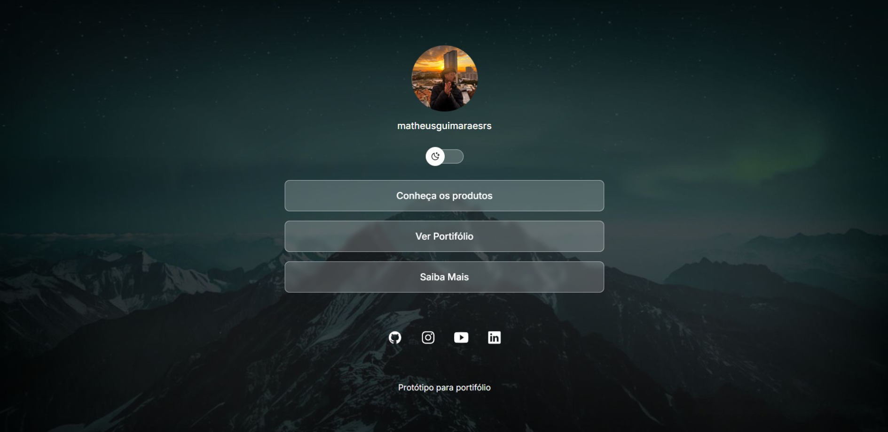
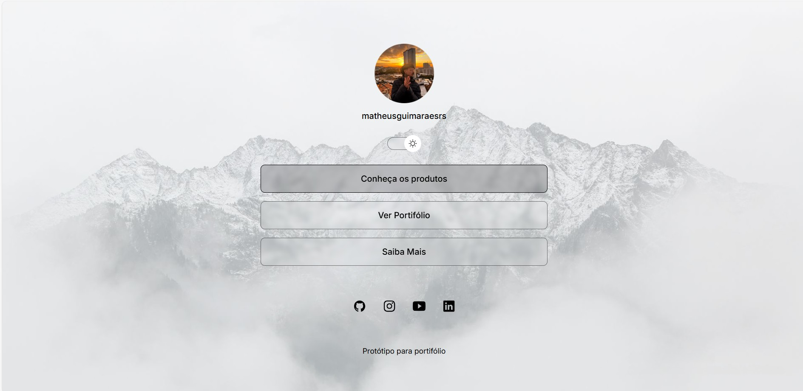
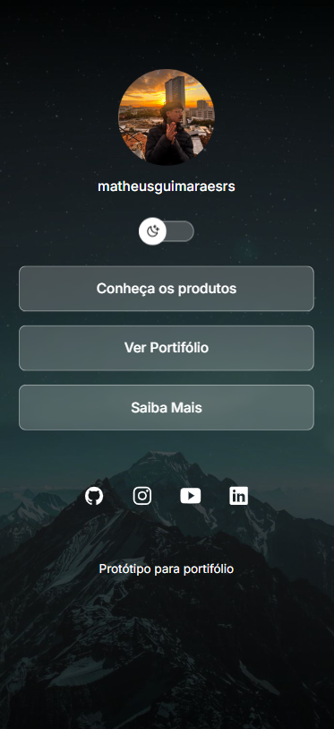
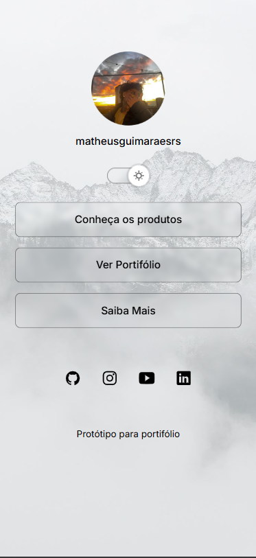

<h1>Projeto Final Discover | Rocketseat</h1>

## Sobre

Esse site foi desenvolvido através do curso Discover da Rocketseat, ministrado pelo professor @maykbrito. 
Realizei uma versão customizada para a entrega do projeto final de conclusão do curso, aplicando os conhecimentos adquiridos ao longo das aulas.
Trata-se de um site de agrupamento de multiplos links para compartilhar portifólio, produtos, informações e rede sociais através de um único link. Foi importante para eu ter meu primeiro contato com o Front End, onde aprendi o básico de HTML, CSS e um pouco de JavaScript.

 

## Dark Mode 

## Light Mode

## Mobile

  
  

## Tecnologias

- HTML
- CSS
- JavaScript
